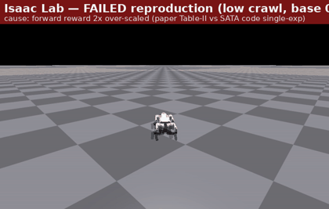
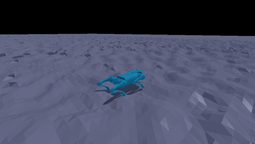

# Torque-based Locomotion, Migrated to Isaac Lab

**A cross-engine reproduction of SATA** — porting a torque-control quadruped
policy from the now-deprecated Isaac Gym to **NVIDIA Isaac Lab**, on the
Unitree Go2.

This is a follow-on to
[bio-inspired-adaptive-locomotion](https://github.com/Stanley-1013/bio-inspired-adaptive-locomotion)
— our reproduction of **SATA** (Safe and Adaptive Torque-Based Locomotion
Policies Inspired by Animal Learning; Li et al., RSS 2025;
[official repo](https://github.com/marmotlab/SATA),
[arXiv:2502.12674](https://arxiv.org/abs/2502.12674)) on Isaac Gym. This repo
asks a narrower, prior question: **does a faithful SATA port survive an engine
change at all**, when the only thing that changes is the simulator? Educational
and research use.

**Current status (2026-06-06):** the direct port trains and walks. We retrained
**8 seeds** of the full bio stack on SATA's rough terrain in Isaac Lab and
compared, term by term, against the Isaac Gym reference. Headline: under matched
config the policy **matches SATA's per-step task-reward terms** (the positive
reward terms match the Gym reference to within ~0.002/step), and the remaining
reward-number gap is concentrated in one penalty term whose cross-engine
definition differs; whether that fully explains it is an open question (see
below). We do **not** claim the two engines are
equivalent. Start here:
[`docs/REPRODUCTION_NOTES.md`](./docs/REPRODUCTION_NOTES.md) (validated settings
+ the result + the gap decomposition) ·
[`docs/specs/2026-06-01-design.md`](./docs/specs/2026-06-01-design.md) (design
brief) · [`results/`](./results/) (the debugging arc).

### What "it walks" looks like (Isaac-Lab-trained trajectory, Gym kinematic replay)

The native Isaac Sim RTX renderer crashes on this container (a known NVIDIA
driver-595 ↔ Isaac Sim `rtx.scenedb` incompatibility — see
[`docs/operations.md`](./docs/operations.md)), so to *see* the gait we replay the
Isaac-Lab-trained joint trajectory kinematically in Isaac Gym (its GL renderer
works here). The teal robot tint + a cooler key light mark these as the Isaac-Lab
reproduction, distinct from the original SATA Isaac-Gym videos.

| reward-bug belly-crawl (early, flat) | clean gait on SATA-rough terrain (post-fix) |
|---|---|
|  |  |
| A 2×-over-scaled forward reward dominated head-height → the robot crawled. | After the faithfulness fixes: s4 walks forward (~2.4 m) on the actual SATA-rough terrain, calves cycling, hard-limit terminations ~0. |

Full clip index (the whole debugging arc, including the broken intermediate
states we kept honestly): [`results/deck/`](./results/deck/) and
[`results/README.md`](./results/README.md).

**Keywords:** Embodied AI · Torque Control · RL · Locomotion · Cross-engine reproduction · Isaac Lab

---

## Overview

SATA's stock Isaac Gym reproduction (the sibling repo) is our **ground truth**:
same robot (Go2), same `rsl_rl` PPO backend, known reference numbers. Keeping the
robot fixed is what makes the migration clean — a new robot would give us no way
to tell a migration bug from a real engine difference. So this slice ports the
full SATA pipeline to Isaac Lab as **directly as we can** and judges the residual
gap against that reference, rather than treating any mismatch as a "cross-engine
effect" by default.

A key sub-migration: Isaac Lab's stock Go2 task defaults to **position (PD)
control**; SATA is a **torque/effort** policy. Configuring effort control to
match SATA's paradigm — then porting the bio layer (activation low-pass, Hill
force-velocity, motor fatigue, Gompertz growth curriculum) on top — is the bulk
of the work.

> Framing: this is a faithful-reproduction exercise, not a new method. Where our
> port deviates from SATA's code we point at the source line and the reason. The
> interesting cross-engine *transfer* question (does the bio feasibility-envelope
> help a policy survive the engine gap better than the ablated policies?) is
> motivated by this work but is **out of scope** for the current slice.

## Status

- **Phase 0 (Install) — done (2026-06-02).** Isaac Sim 5.1 + Isaac Lab on the
  lab K8s container (no sudo, NFS `$HOME`, A6000). Install gotchas recorded in
  [`docs/operations.md`](./docs/operations.md).
- **Port (effort control + bio layer) — done.** Torque/effort control,
  bio-constraint math (19 sim-free tests pass:
  [`tests/`](./tests/)), Gompertz growth, SATA-faithful observations, rough
  terrain, and domain randomisation. Validated settings:
  [`docs/REPRODUCTION_NOTES.md`](./docs/REPRODUCTION_NOTES.md).
- **Faithfulness debugging — done.** Six fixes turned a belly-crawling /
  calf-locked policy into a clean walk; the one that closed the gait gap was that SATA's joint
  *position* limits were only used in the reward/termination and never written to
  the physics sim, so the wider stock-USD thigh limit let exploration over-extend
  and trip the hard-limit termination on most episodes. The full iteration-by-
  iteration timeline (each broken intermediate kept) is in
  [`results/`](./results/).
- **8-seed reproduction (SATA-rough) — done.** Retrained 8 seeds of the full bio
  stack and decomposed the gap to the Gym reference per reward term (below). Raw
  training logs are gitignored; numbers are recomputed from those logs and from
  the read-only Gym reference tfevents.

### 8-seed result (SATA-rough terrain)

Reward = `rsl_rl`'s mean episodic return at iter 3000 (4096 envs); mean ± sample
std (ddof=1).

|                       | mean reward (8 seeds) | clean 7 (drop 1 collapse) |
|-----------------------|-----------------------|----------------------------|
| Isaac Lab (ours)      | **76.8 ± 16.2**       | 82.3 ± 5.0                 |
| Isaac Gym (SATA ref)  | 103.6 ± 16.0          | 108.6 ± 8.0                |

Both engines show the *same* structure: 7 seeds cluster, 1 collapses late in PPO
(ours `s5` → 38.4; the Gym reference `s7` → 68.4). We report the 8-seed number
*with* the collapse as the headline, not the cleaner 7-seed number.

### Where the gap lives (per-step decomposition)

Removing the episode-length confound (per-step = mean return / mean episode
length), the 0.76 reward ratio factors into **~10% shorter episodes × ~16% lower
per-step reward**. Splitting the per-step number by reward term (clean seeds
only):

| term         | Gym/step | Lab/step | Lab−Gym |
|--------------|----------|----------|---------|
| forward      |  0.0400  |  0.0388  | −0.0012 |
| head_height  |  0.0130  |  0.0131  | +0.0001 |
| moving_y     |  0.0161  |  0.0138  | −0.0023 |
| moving_yaw   |  0.0127  |  0.0131  | +0.0004 |
| roll         | −0.0017  | −0.0014  | +0.0003 |
| lin_vel_z    | −0.0007  | −0.0007  |  0.0000 |
| fatigue      | −0.0130  | −0.0110  | +0.0020 |
| joint_acc    | −0.0111  | −0.0194  | −0.0083 |

What we observe (on the axis we measured — not a claim about the mechanism):

- The positive/task terms (forward, head_height, moving_y, moving_yaw) match the
  Gym reference to within **~0.002/step** — the policy reproduces SATA's per-step
  task performance.
- The per-step deficit is concentrated almost entirely in one penalty term,
  `joint_acc` (≈93% of the per-step gap). SATA's `_reward_dof_acc` is a finite
  difference; our term uses PhysX5's *instantaneous* `data.joint_acc`, which
  captures contact-impact spikes the finite difference smooths over (we tried
  matching the finite-difference form — it trained markedly worse and was
  reverted). This **suggests** the residual is dominated by how this one term is
  *measured*, not by worse locomotion.

**Open questions (honest).** We have *not* separated "the penalty measures
acceleration differently" from "the Lab gait is genuinely jerkier" — confirming
the former would need joint-acceleration trajectories logged under one matched
definition on both engines. The ~10% episode-length shortfall is left as a real,
unexplained residual rather than attributed to a cause we have not isolated.
Full provenance and the per-term derivation:
[`docs/REPRODUCTION_NOTES.md`](./docs/REPRODUCTION_NOTES.md).

## Repository

```
src/torque_loco/   the port: effort-control env, bio constraints, growth,
                   SATA reward/MDP terms, rough terrain, env registration
tests/             sim-free unit tests for the bio math / growth / metrics
scripts/           train / play / eval / envelope-aggregation / replay-render helpers
docs/              reproduction notes, design spec, operations log, deck assets
results/           the debugging arc (numbered experiments) + verification clips
```

Documentation:
- **Validated settings + the 8-seed result + the gap decomposition (start here):**
  [`docs/REPRODUCTION_NOTES.md`](./docs/REPRODUCTION_NOTES.md)
- **Design brief:** [`docs/specs/2026-06-01-design.md`](./docs/specs/2026-06-01-design.md)
- **What actually happened during setup/runs (install gotchas, run conventions):**
  [`docs/operations.md`](./docs/operations.md)
- **Chronological experiment index + clip gallery:** [`results/README.md`](./results/README.md)

## Experiment setup

| Item | Configuration |
|------|---------------|
| Robot | Unitree Go2 (simulation-based) |
| Engine | NVIDIA Isaac Lab (Isaac Sim 5.1) — reference is Isaac Gym Preview 4 |
| Control | Torque / effort (Isaac Lab stock Go2 defaults to position PD) |
| Task | SATA `go2_torque`, ported (rough trimesh terrain) |
| Algorithm | PPO (`rsl_rl`), net [512, 256, 128], matched to SATA's hyperparameters |
| Training | 3000 iterations, 4096 envs, 8 seeds (HW: A6000) |
| Reference | Isaac Gym SATA reproduction (sibling repo), reward 103.6 ± 16.0 |

## Key references

1. SATA: Safe and Adaptive Torque-Based Locomotion Policies Inspired by Animal Learning (RSS 2025). [arXiv:2502.12674](https://arxiv.org/abs/2502.12674) · [code](https://github.com/marmotlab/SATA)
2. Sibling reproduction (Isaac Gym): [bio-inspired-adaptive-locomotion](https://github.com/Stanley-1013/bio-inspired-adaptive-locomotion)
3. NVIDIA Isaac Lab. [docs](https://isaac-sim.github.io/IsaacLab/)
4. `rsl_rl` PPO. [repo](https://github.com/leggedrobotics/rsl_rl)
5. Hill, A. V., The heat of shortening and the dynamic constants of muscle (Proc. R. Soc. B, 1938). [doi:10.1098/rspb.1938.0050](https://royalsocietypublishing.org/doi/10.1098/rspb.1938.0050)

## License

MIT — see [LICENSE](./LICENSE).

---

> **Takeaway:** a *direct* port of SATA from Isaac Gym to Isaac Lab walks, and on
> the axis we measured it reproduces SATA's per-step task performance under
> matched config. The remaining reward-number gap is dominated by one penalty
> term with a documented cross-engine definitional difference — which we report as
> such, without claiming the engines are equivalent.
